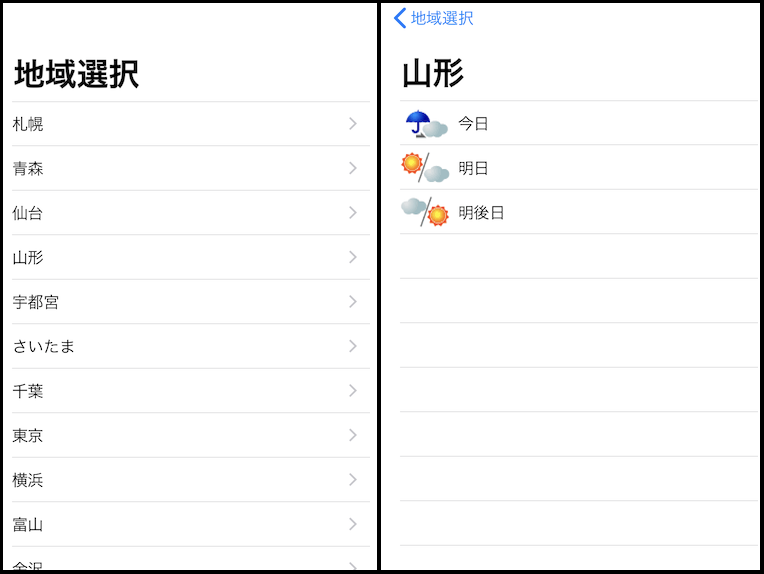

# SwiftUI + Combine example 

Showing Weather forecast using SwiftUI + Combine.framework.

Selecting a area, and show the forecast of the area.

## app structure

* XxxView
  * similar to fragment in android
  * create inner-view and set `EnvironmentObject`
* XxxViewInner
  * rendering view, created by XxxView
* XxxViewModel
  * Fetching data and notice changes to view
  * using `Combine.framework`

## notice

This app turned off HTTPS for using http service.

Area list is holded on local,not fetched from network. but forecasts comes form network.

This app using [livedoor Weather hacks](http://weather.livedoor.com/weather_hacks/webservice), free API. So please be careful not to call many times.

## requirements

* Xcode11 beta

If you aren't going to use Preview, Mac Beta is not required.

## thanks

* [livedoor Weather hacks](http://weather.livedoor.com/weather_hacks/webservice)

