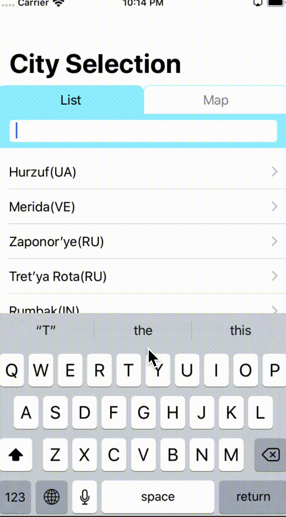

# SwiftUI + Combine Weather

Showing Weather forecast using SwiftUI + Combine.framework.

Select a area, and show daily forecasts, using [OpenWeather API](https://openweathermap.org/api)

## Highlight of this app

* SwiftUI.framework
* Combine.framework
  * used in network-access and state - manegemnt
* Clean Architecture
  * View - ViewModel - Repository
* NetworkImageView
* MKMapView with CoreLocation
  * GPS with Combine.framework
  * detect tap and add pin at tap position
* Sample implementation of `MainThreadScheduler`
  * but, this won't work with delay-call.
* Adapt dark mode with asset-catalog-colors

## how to run

* Install Xcode11.0 beta
  * you need not install MacBeta (but you can't use preview)
* Build and Run

By default, this app will access local-json file.  
If you want to use network-api, please do as following

* sign in [OpenWeather](https://openweathermap.org/) and create Api Key
* rename `Config-sample.plist` to `Config.plist`
* Write your Api Key in `Constants.plist`

> city_list.json from Openweather is too big (20MB!).
> So I shrinked it. Please check city_json/

## file structure

+ /  
  +- Config-sample.plist : config base file. rename and set your key
  +- RootView.swift : view at app-launching  
  +- Theme.swift : Color list  
  +- asset/ : cities and sample json  
  +- Entity/  
  +- Network/  
  +- PartsView/  : common views  
  +- Repository/  
  +- Utils/  
  +- View  
  += ViewModel  

## app structure

* Use Clean Architecture,
* avoid using `@State` in view.(except TextField, it requires state)
* use ViewModel for view state management. 
* use Repository for fetching data

Basic Structure

> Fragment - View - ViewModel - Repository

* Fragment
  * create ViewModel and put it to the environment.
  * create View with ViewModel
  * manage lifecycle-related-operation
* View
  * render view, created by Fragment
  * bind with `ViewModel` and call its functions.
* ViewModel
  * Manage View-State
  * `BindableObject`
* Repostiroy
  * Fetch data

## thanks

* [OpenWeather](https://openweathermap.org/)
* Many repositories using SwiftUI and authors.

## Known issues

* MainThreadScheduler won't work with delay-time
  * when I call action() an `DispatchQueue.main.async`, nothing happens.
* Weather5DayView causes memory-leaks
  * I found that `List` causes it. But I can't find the way to fix this.